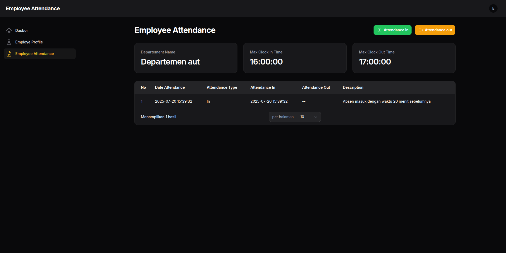

# Fullstack Developer Challenge Test



---

##  Daftar Isi
* [Tentang Project](#tentang-project)
* [Fitur Utama](#fitur-utama)
* [Teknologi yang Digunakan](#teknologi-yang-digunakan)
* [Instalasi & Persiapan](#instalasi--persiapan)
* [Cara Penggunaan](#cara-penggunaan)
* [Kontak](#kontak)

---

## Tentang Project
Sebuah perusahaan Multinasional memiliki jumlah karyawan diatas 50 karyawan, dan memiliki berbagai macam Divisi atau departemen didalamnya. Karena banyaknya karyawan untuk dikelola, perusahaan membutuhkan Sistem untuk Absensi guna mencatat serta mengevaluasi kedisiplinan karyawan secara sistematis.

---

## ✨ Fitur Utama
* **Manajemen Karyawan:** Tambah, edit, dan hapus data karyawan. Didukung dengan validasi form yang ketat.
* **Manajemen Departemen:** Kelola departemen dan tetapkan batas waktu jam masuk.
* **Absensi (Clock In / Clock Out):** Karyawan dapat melakukan absensi masuk dan keluar.
* **Riwayat Absensi:** Lihat dan filter riwayat absensi per departemen atau per tanggal.

---

## 🛠️ Teknologi yang Digunakan
* **Backend:** PHP 8.4.1, Laravel 12
* **Frontend:** Blade, Tailwind CSS
* **Database:** MySQL
* **Admin Panel:** Filament
---

## 🚀 Instalasi & Persiapan
Ikuti langkah-langkah berikut untuk menjalankan proyek ini secara lokal.

1.  **Clone repositori**
    ```bash
    git clone https://github.com/Karungg/employee-attendance.git
    cd employee-attendance
    ```

2.  **Install dependensi Composer**
    ```bash
    composer install
    ```

3.  **Buat file `.env`**
    Salin file `.env.example` menjadi `.env`.
    ```bash
    cp .env.example .env
    ```

4.  **Generate application key**
    ```bash
    php artisan key:generate
    ```

5.  **Konfigurasi Database**
    Buka file `.env` dan sesuaikan pengaturan database (`DB_DATABASE`, `DB_USERNAME`, `DB_PASSWORD`).

6.  **Jalankan Migrasi & Seeder**
    Ini akan membuat semua tabel database dan mengisi data awal yang diperlukan.
    ```bash
    php artisan migrate --seed
    ```

7.  **Jalankan server lokal**
    ```bash
    php artisan serve
    ```
    Aplikasi sekarang berjalan di `http://127.0.0.1:8000/admin`.

8.  **Akun Admin**
    * **Email:** `admin@gmail.com`
    * **Password:** `password`
      
9.  **Akun Employee**
    * **Email:** `employee@gmail.com`
    * **Password:** `password`

---

## 📝 Cara Penggunaan
Setelah login, Anda dapat mulai mengelola data master seperti departemen dan karyawan. Karyawan yang login dapat langsung melakukan absensi pada halaman dasbor.
<br>
**Video Demo Aplikasi**
<br>
link : https://drive.google.com/drive/folders/1kxrPgKsykIaptpyNJF-vmnZvZELzFq0S?usp=sharing

---

## 📧 Kontak
[Miftah Fadilah] - [miftahfadilah71@gmail.com]
